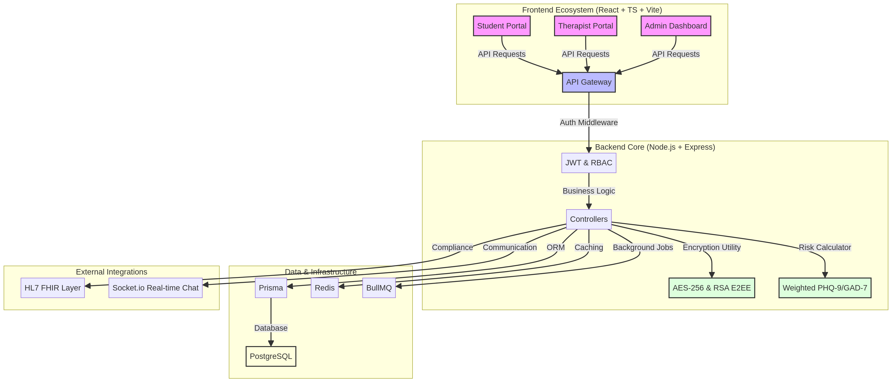

# MindTrackEDU: Official Repository

<div align="center">
  
  <h3>Revolutionizing Student Mental Health with Global Standards</h3>
  <p><strong>Empowering students, therapists, and educational institutions through data-driven insights and AI-powered support.</strong></p>
</div>

---

## 🏗️ System Architecture | المعمارية التقنية

MindTrackEDU is built with a **high-security, scalable architecture** designed for global healthcare standards. 

- **Frontend**: React + TypeScript + Vite (Student & Therapist Portals)
- **Backend**: Node.js + Express + Prisma (Core Business Logic)
- **Security**: AES-256 & RSA-4096 End-to-End Encryption
- **Analytics**: Weighted PHQ-9/GAD-7 Clinical Risk Assessment

👉 **[View Detailed Architecture Diagram](./docs/architecture.png)**

---

## 🛠️ Technical Core (Deep Links) | النواة التقنية

For developers and reviewers, here are the direct links to the **actual implementation code**:

| Module | Purpose | Link |
|--------|---------|------|
| **Encryption Core** | AES-256 & RSA-4096 Implementation | [encryption.ts](./nsmpi/backend/src/utils/encryption.ts) |
| **Risk Assessment** | Clinical Scoring & Weighted Analytics | [screeningCalculator.ts](./nsmpi/backend/src/utils/screeningCalculator.ts) |
| **Messaging Schema** | E2EE Chat Data Structures | [chat.ts](./nsmpi/backend/src/types/chat.ts) |
| **Global Compliance** | GDPR, HIPAA, & ISO Standards | [COMPLIANCE.md](./COMPLIANCE.md) |
| **Frontend UI** | React Login & Role-Based Access | [Login.tsx](./app/src/components/Login.tsx) |

---

## 🗺️ Global Roadmap | خارطة الطريق العالمية

We follow a strategic roadmap to scale MindTrackEDU into a global leader in mental health technology.

👉 **[View the Full Global Roadmap (ROADMAP.md)](./ROADMAP.md)**

---

## 🚀 Quick Start | البداية السريعة

```bash
# Clone the repository
git clone https://github.com/YOMNA190/MindTrackEDU-Official.git

# Navigate to the backend
cd nsmpi/backend
npm install
npm run dev

# Navigate to the frontend
cd ../frontend
npm install
npm run dev
```

---

## 📜 License | الترخيص

This project is licensed under the **MIT License**.

---
*© 2026 MindTrackEDU-Official. Together for Student Mental Health.*
